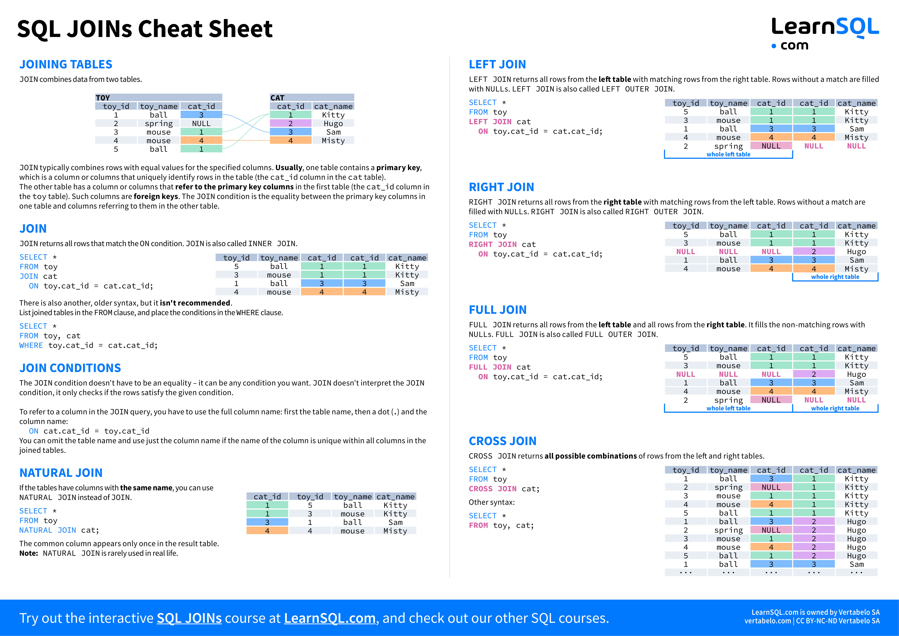

# Bioinformatica 2024/2025
## Docente: Mattia Cozzi

In questo repository sono presenti tutti i materiali inerenti al corso di Bioinformatica. Di seguito, qualche precisazione su di essi.

### Scaricare i materiali per il corso

Per scaricare un archivio compresso (zip) di *tutti i materiali*, selezionare il bottone "Code" in alto a destra e poi "Download ZIP".

### Slides

Le slides utilizzate a lezione. Sono il materiale di partenza ma *non sostituiscono gli appunti* né le esercitazioni.

### Esempi

Capire la programmazione significa vederla in azione, perché vogliamo acquisire una conoscenza procedurale e non meramente mnemonica. È quindi fondamentale, oltre agli esempi di codice riportati nelle slides, spulciare in autonomia gli esempi proposti, eventualmente anche per riutilizzare nei nostri algoritmi parte del codice che contengono.

### Esercizi

Senza svolgere esercizi non è possibile imparare *nulla*! In questo corso vengono proposti più di 150 esercizi. La cosa migliore è svolgerli tutti.

### Soluzioni

Dopo aver provato a risolvere *in autonomia* un esercizio e dopo aver controllato che il codice non restituisca errori, può essere utile un confronto con la soluzione proposta dal docente.

Le soluzioni sono da intendersi non come l'*unico* modo di scrivere l'algoritmo richiesto, ma come *uno* tra quelli possibili.

### Database

È fondamentale, anche studiando SQL, *far pratica*. Creare un database da zero è piuttosto lungo e può essere complicato, pertanto vengono proposti tre database di esempio che contengono diversi dati.

- **db-profumi**, che contiene dati su profumi, sui brand che li hanno prodotti e sui nasi che li hanno creati;
- **db-cosmesi**, che contiene dati su prodotti cosmetici, sui brand che li hanno prodotti e sulla categoria di appartenenza;
- **db-pharma**, un database più esteso, che contiene i dati relativi ad un'azienda che rifornisce diversi clienti di prodotti farmaceutici, che a sua volta acquista da alcuni fornitori; è l'unico database i cui dati non sono realistici, ma è comunque utilizzabile per capire il funzionamento di un database complesso.

#### Diagrammi

Di tutti e tre i database di esempio è riportato il **diagramma Entità-Relazione**, da tenere a portata di mano quando si manipolano i database per leggere i nomi e gli attributi delle entità che utilizziamo. Il diagramma ER può essere visualizzato in Visual Studio Code scaricando l'estensione Markdown Preview Mermaid Support. 

Ricorda che i file in Markdown (estensione .md) possono essere visualizzati con la funzione "Anteprima" di Visual Studio Code (premi CTRL+SHIFT+V quando il file è aperto in VS Code).

#### Formato dei database

I database sono forniti in formato SQL (da importare in phpMyAdmin, come spiegato nella guida) e, per una immediata consultazione dei dati, in formato XLSX (Excel).

### File CSV e JSON per pandas

Le strutture di dati possono essere fornite anche utilizzando file di testo semplice, come quelli utilizzati in questo corso. Nella cartella "pandas" sono inclusi due file (un CSV e un XLSX) da utilizzare per svolgere gli esercizi. Nei file sono contenuti dati relativi ai vincitori/vincitrici dell'Oscar come miglior attore/attrice protagonista e l'età al momento della vittoria.

Importare questi file nei nostri algoritmi in Python ci permette di manipolare i dati in essi presenti.

### Libri

Nonostante le slides siano state pensate come materiale di apprendimento completo, per approfondire o chiarirsi un concetto può essere utile un approccio più "classico".

La mia preferenza personale va al libro "Python per tutti" ("Python for Everybody") di Charles Severance. Con una semplice ricerca online è possibile recuperare gratuitamente anche tutti i materiali utilizzati dal libro.

### Cheat sheet

Durante il corso, non è necessario *imparare a memoria* tutti i comandi di Python: alcuni ci resteranno in mente perché li useremo decine di volte, altri meno.

È prassi abituale, quando si programma, tenere a portata di mano un *cheat sheet*, quello che alle scuole superiori sarebbe stato simile ad un "bigliettino". *Non è barare* ed è anzi una modalità di lavoro incoraggiata!

Nulla vieta che ognuno/a, durante il suo percorso di apprendimento, prepari il suo **cheat sheet personale**.

### Manuale

**[in lavorazione]** Un file che contiene *tutti* i comandi citati nel corso; il file può essere stampato e utilizzato durante l'esame.

### Modalità d'esame
**[in lavorazione]**