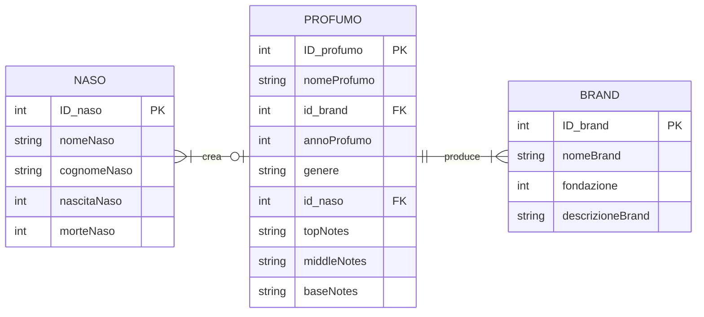
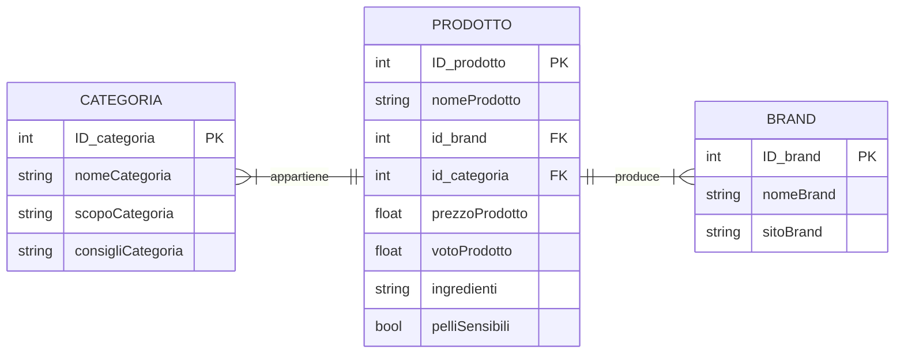
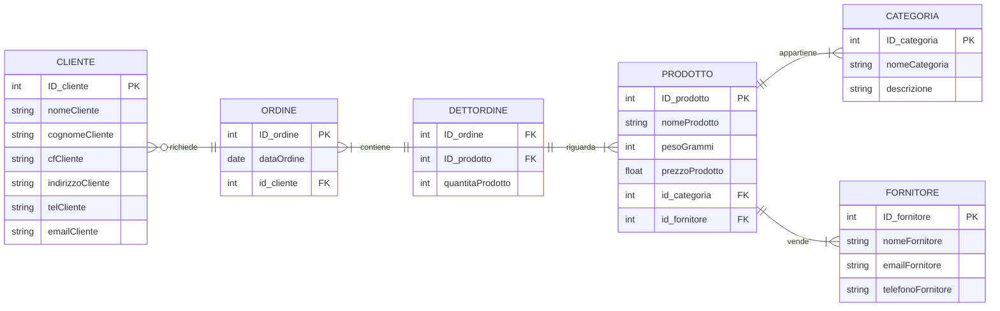

# I database di esempio

I grafici seguenti (per vedere i quali è necessaria l'estensione Markdown Preview Mermaid Support) mostrano la struttura dei database proposti come esempio per questo corso.

I primi due (db-profumi e db-cosmesi) sono semplici database organizzati in modo molto simile:
- tre entità, con le loro caratteristiche (di cui è indicato il tipo);
- una entità "centrale", principale, complessa;
- due entità "minori", richiamate nella tabella dell'entità centrale con una chiave esterna (FK).

Il terzo (db-pharma) è più complicato, sia per il numero di entità contenute, sia per le relazioni che legano tra loro queste entità.

## Database "Profumi"

## Database "Cosmesi"

## Database "Pharma"

## Importazione dei database da usare negli esercizi

Per importare i database di esempio da usare negli esercizi, usiamo l'interfaccia web di phpMyAdmin.

### Creazione nuovo db da phpMyAdmin

Una volta avviato XAMPP e attivati i server Apache e MySQL, apriamo con un browser il link http://localhost/phpmyadmin.

Nella barra di sinistra, selezioniamo la prima opzione, "Nuovo" per creare un nuovo database. Inseriamo il nome del database (db-profumi, db-cosmesi oppure db-pharma). Questo sarà il nome del database da usare nei nostri script di Python, che inizieranno ad esempio con:

    import mysql.connector
    
    mydb = mysql.connector.connect(
        host = "localhost",user = "root",password = "",
        database="db-profumi",
    )
    
    mycursor = db-profumi.cursor()

### Importazione di tabelle e dati

Una volta creato il database, ci basterà importare il file sql corrispondente al database. Nel file sql sono contenute tutte le istruzioni per creare le tabelle e le relazioni tra esse. Nel file sql sono indicate anche le chiavi (primarie ed esterne).

Può essere utile leggere il codice di questo file per capire bene che cosa stiamo eseguendo sul nostro server.

Clicchiamo, nel menu in alto, su "Importa" e nel primo form scegliamo il file sql corrispondente al database che abbiamo creato. Lasciamo tutte le altre impostazioni ai valori predefiniti. Clicchiamo infine su "Importa" in fondo alla pagina.

L'importazione, soprattutto dei database più grandi, può richiedere qualche secondo.

### Controllo dell'importazione

Per controllare di aver importato il db correttamente, possiamo visualizzare le tabelle che contiene (menu ad albero sulla sinistra) e vedere le relazioni tra esse (scheda "Designer").

---------- 

### Extra: realizzare diagrammi con Mermaid

https://mermaid.js.org/syntax/entityRelationshipDiagram.html

