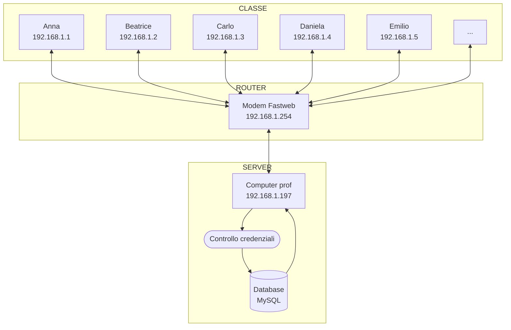

# Simulatore di database di rete

## Collegarsi al simulatore di database di rete via web

La rete WiFi a cui collegarsi è **LAN-simulator**, che non richiede password.

Una volta connessi, per visualizzare il pannello di controllo di phpMyAdmin visitiamo l'indirizzo:

    http://192.168.1.197:8080/phpmyadmin

Nell'indirizzo precedente, `192.168.1.197` è l'indirizzo IP del server SQL su cui lavoriamo, mentre `8080` è la porta su cui MySQL è "in ascolto".

## Collegarsi al simulatore di database di rete via Python

Di seguito il codice Python per collegarsi, durante le esercitazioni, al server (cioè, al computer del docente):

    import mysql.connector
    #connessione al database di rete
    mydb = mysql.connector.connect(
        host = "192.168.1.197", #IP del server
        user = "root",          #utente
        password = "lan"        #password del server
    )
    print(mydb)

## Schema della nostra LAN

------
### Risorse per l'impostazione di XAMPP in LAN:

- https://stackoverflow.com/questions/5524116/accessing-localhost-xampp-from-another-computer-over-lan-network-how-to
- https://stackoverflow.com/questions/19101243/error-1130-hy000-host-is-not-allowed-to-connect-to-this-mysql-server