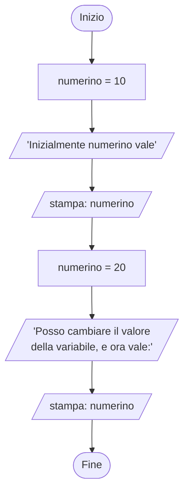

```mermaid
graph TB
    A([Inizio]) --> B[numerino = 10] 
    B --> C[/ 'Inizialmente numerino vale' /]
    C --> D[/stampa: numerino/]
    D --> E[numerino = 20] 
    E --> F[/'Posso cambiare il valore
    della variabile, e ora vale:'/]
    F --> G[/stampa: numerino/]
    G --> H([Fine])
```