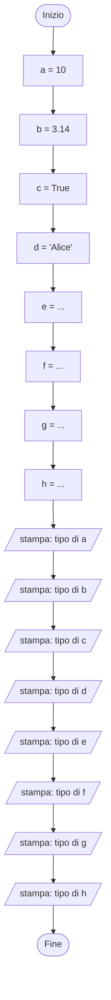

```mermaid
graph TB
    A([Inizio]) --> B[a = 10] --> C[b = 3.14] --> D[c = True] --> E[d = 'Alice'] --> F[e = ...] --> G[f = ...] --> H[g = ...] --> I[h = ...] --> J[/stampa: tipo di a/] --> K[/stampa: tipo di b/] --> L[/stampa: tipo di c/] --> M[/stampa: tipo di d/] --> N[/stampa: tipo di e/] --> O[/stampa: tipo di f/] --> P[/stampa: tipo di g/] --> Q[/stampa: tipo di h/] --> R([Fine])
```