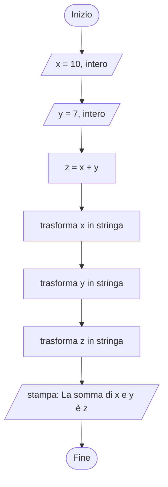

```mermaid
graph TB
    A([Inizio]) --> B[/x = 10, intero/] 
    B --> C[/y = 7, intero/] 
    C --> D[z = x + y] 
    D --> E[trasforma x in stringa]
    E --> F[trasforma y in stringa]
    F --> G[trasforma z in stringa]
    G --> H[/stampa: La somma di x e y è z/]
    H --> I([Fine])
```