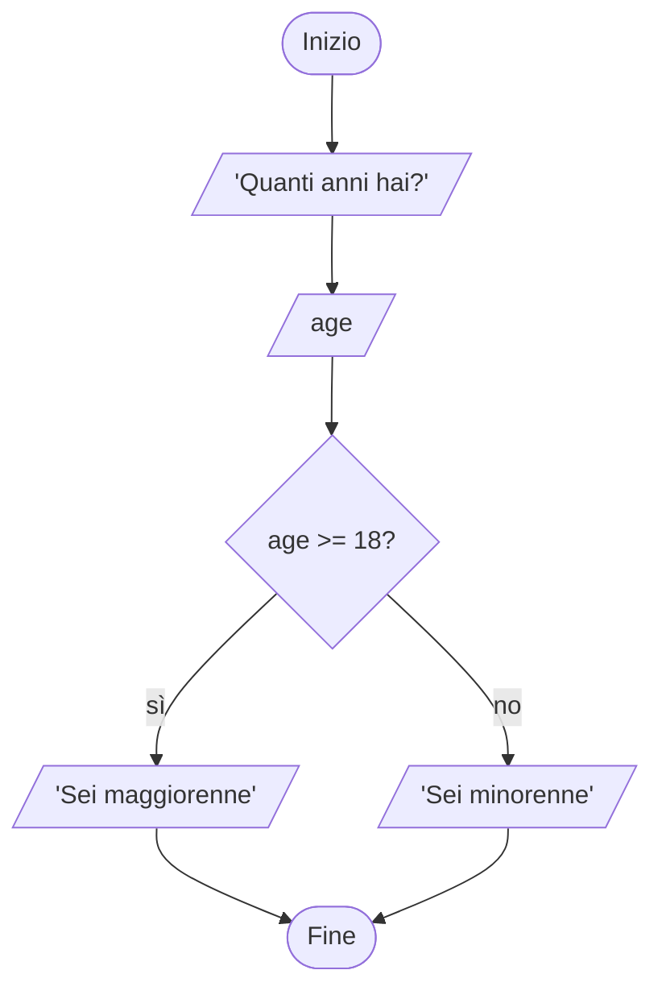

```mermaid
graph TB
    A([Inizio]) --> B[/'Quanti anni hai?'/] 
    B --> C[/age/]
    C --> D{age >= 18?}
    D -->|sì| E[/'Sei maggiorenne'/]
    D -->|no| F[/'Sei minorenne'/]
    E --> G([Fine])
    F --> G
```