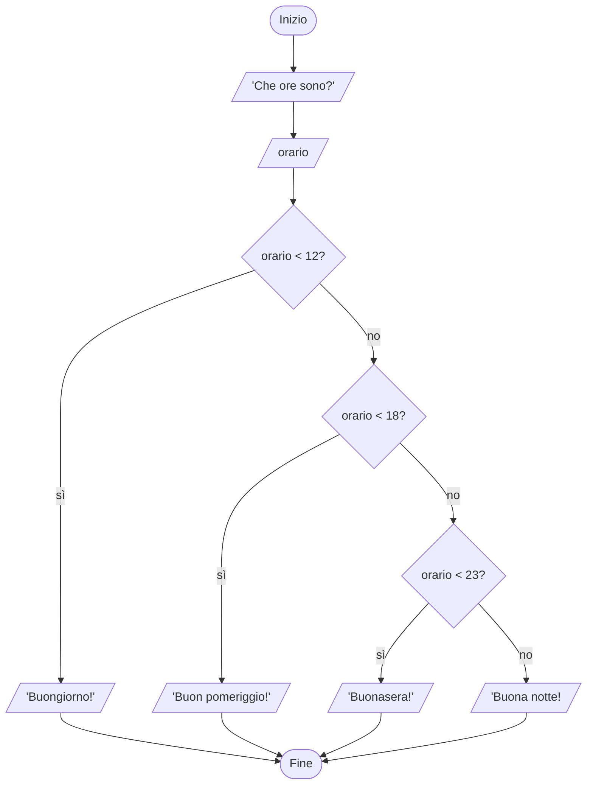

```mermaid
graph TB
    A([Inizio]) --> B[/'Che ore sono?'/] 
    B --> C[/orario/]
    C --> D{orario < 12?}
    D -->|sì| E[/'Buongiorno!'/]
    D -->|no| F{orario < 18?}
    E --> G([Fine])
    F -->|sì| H[/'Buon pomeriggio!'/]
    F -->|no| I{orario < 23?}
    I -->|sì| J[/'Buonasera!'/]
    I -->|no| K[/'Buona notte!/]
    H --> G
    J --> G
    K --> G
```