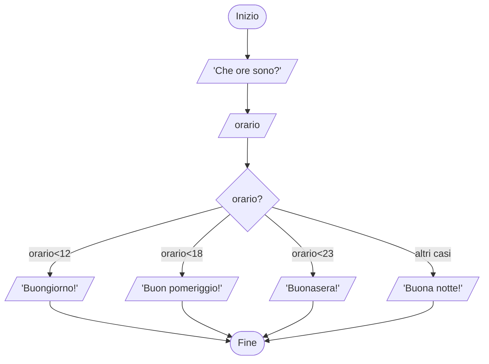

```mermaid
graph TB
    A([Inizio]) --> B[/'Che ore sono?'/] 
    B --> C[/orario/]
    C --> D{orario?}
    D -->|orario<12| E[/'Buongiorno!'/]
    D -->|orario<18| F[/'Buon pomeriggio!'/]
    D -->|orario<23| G[/'Buonasera!'/]
    D -->|altri casi| H[/'Buona notte!'/]
    E --> I([Fine])
    F --> I
    G --> I
    H --> I
```