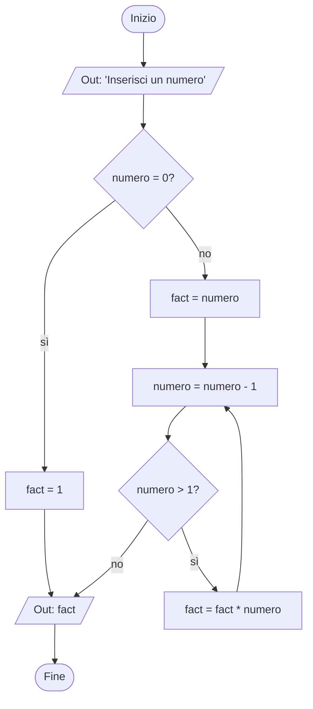

### Nota sui file .md
I file di Markdown (estensione .md) possono essere visualizzati con resa grafica (codice e diagrammi compresi) con la "Visualizzazione anteprima" di Visual Studio Code. La scorciatoia è CTRL+SHIFT+V.

Per visualizzare correttamente i diagrammi, installare l'estensione "Markdown Preview Mermaid Support".

### Traccia
Realizza la pseudocodifica e il diagramma a blocchi di un algoritmo che riceva in input un numero e ne calcoli il fattoriale.

### Pseudocodifica
```
inizio
    stampa "Inserisci un numero"
    ricevi numero
    se numero = 0
        fact = 1
    altrimenti
        fact = numero
        ripeti finché numero > 1
            numero = numero - 1
            fact = fact * numero
    stampa fact
fine
```

### Diagramma
