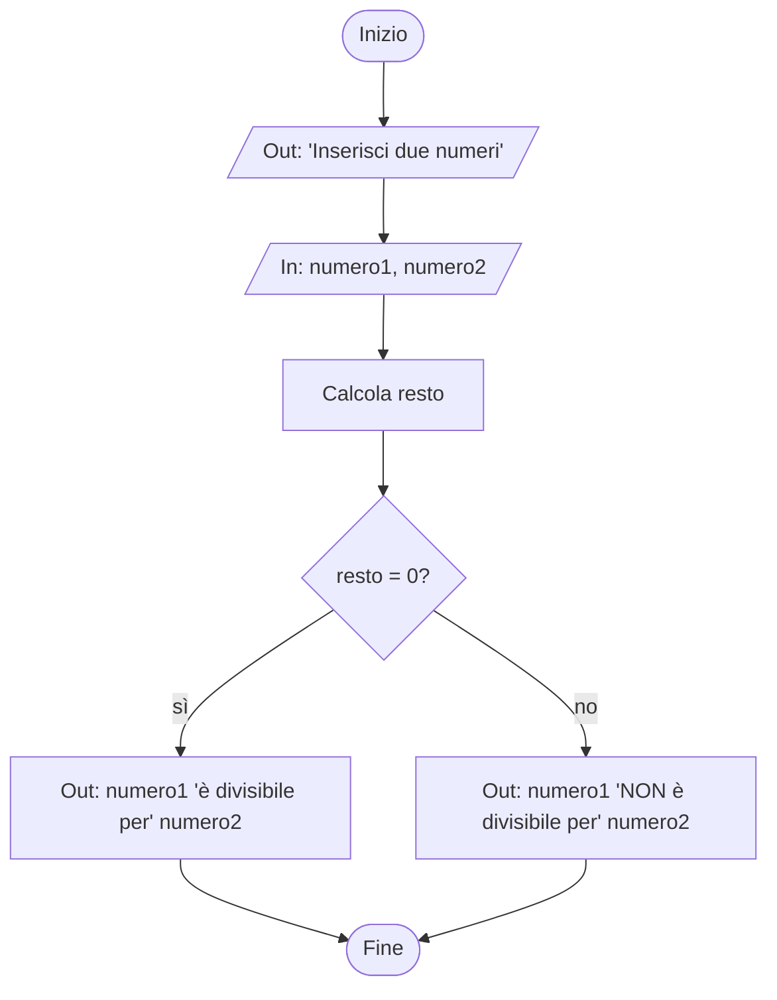

### Traccia
Realizza la pseudocodifica e il diagramma a blocchi di un algoritmo che riceva in input due numeri e calcoli se il primo è divisibile per il secondo.

### Pseudocodifica
```
inizio
    stampa "Inserisci due numeri"
    ricevi numero1
    ricevi numero2
    calcola resto numero1/numero2
    se resto = 0
        stampa numero1 "è divisibile per" numero2
    altrimenti
        stampa numero1 "NON è divisibile per" numero2
fine
```

### Diagramma
