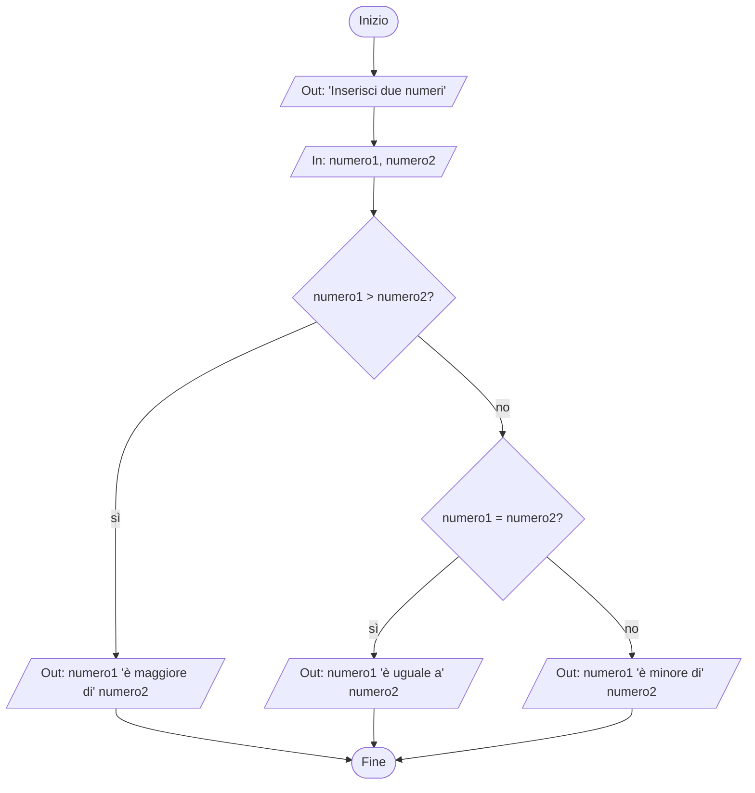

### Traccia
Realizza la pseudocodifica e il diagramma a blocchi di un algoritmo che riceva in input due numeri e dica quale dei due è il maggiore.

### Pseudocodifica
```
inizio
    stampa "Inserisci due numeri"
    ricevi numero1
    ricevi numero2
    se numero1 > numero2
        stampa numero1 "è maggiore di" numero2
    altrimenti
        se numero1 = numero2
            stampa numero1 "è uguale a" numero2
        altrimenti
            stampa numero1 "è minore di" numero2
fine
```

### Diagramma

