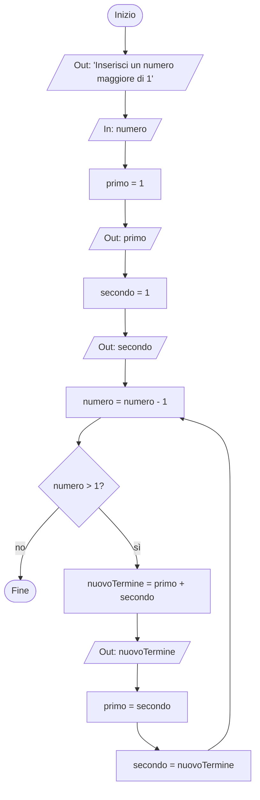

### Traccia
Realizza la pseudocodifica e il diagramma a blocchi di un algoritmo che riceva in input un numero e che abbia come output la sequenza di Fibonacci con un numero di termini pari al valore ricevuto in input.

### Pseudocodifica
```
inizio
    stampa "Inserisci un numero maggiore di 1"
    ricevi numero
    primo = 1
    stampa primo
    secondo = 1
    stampa secondo 
    ripeti finché numero > 1
        numero = numero - 1
        nuovoTermine = primo + secondo
        stampa nuovoTermine
        primo = secondo
        secondo = nuovoTermine
fine
```

### Diagramma
